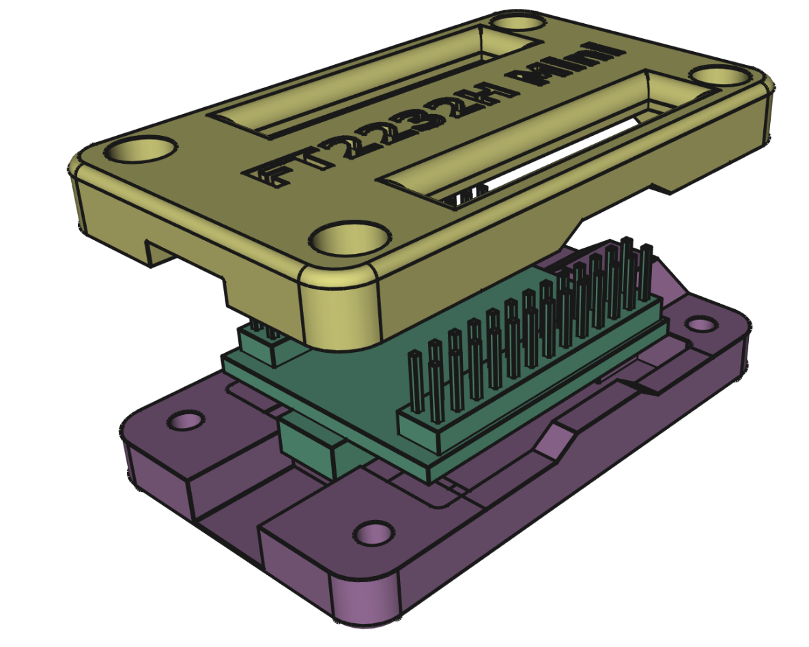

# FT2232H mini module case
A case for the FT2232H mini module from FTDI created in FreeCAD.

Note: The hole for the USB mini B plug has the specific size to match my cable.
You need to change the dimensions inside `Case -> USB_cutout -> USB_sketch` to match your cable.
This is done in this way to lock the lock the cable in place because those USB mini B connectors can be
quite fragile.

# Part list of none printed components

| Part          | Count |
|---------------|-------|
| M3x8          | 4     |
| M3 square nut | 4     |

# File names with descriptions

| File name                                   | Description           |
|---------------------------------------------|-----------------------|
| `./FT2232H_mini_debugger.FCStd`             | The main FreeCAD file |
| `./ft2232h_case.png`                        | The image above       |
| `./FT2232H_mini_debugger-Top_split.step`    | 3D printing file      |
| `./FT2232H_mini_debugger-Bottom_split.step` | 3D printing file      |

